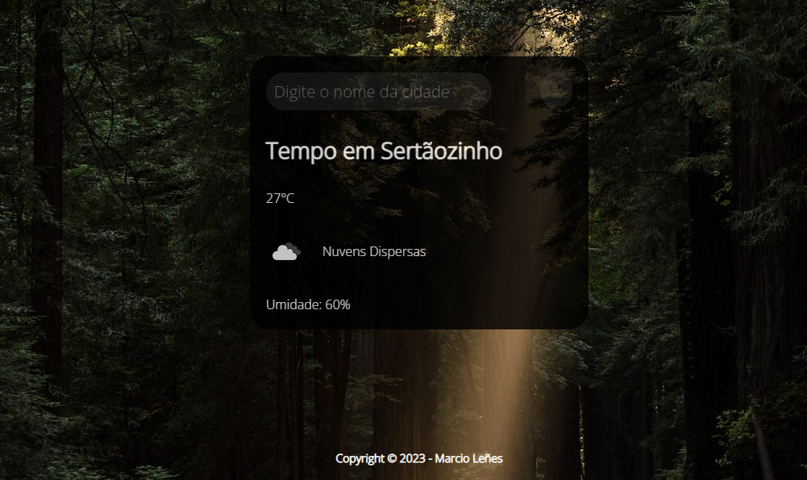

##  App de Previsão do Tempo
### Esse projeto foi criado utilizando a API do openweathermap.org.
 

  </img>

 

### Tecnologias utilizadas:

 

  
  
  

 

### Visualização do projeto: 

- [Previsão do Tempo](https://pizzaria-b7web.netlify.app/)
